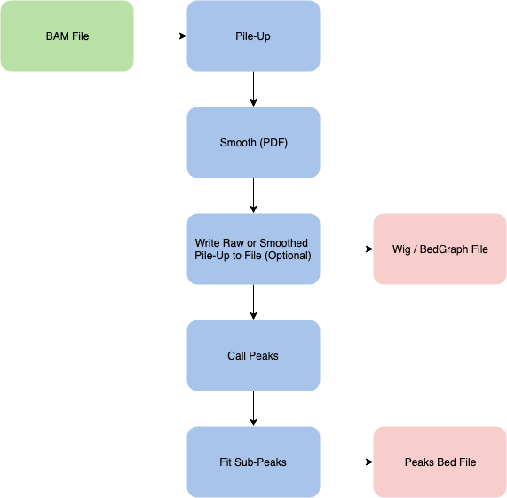
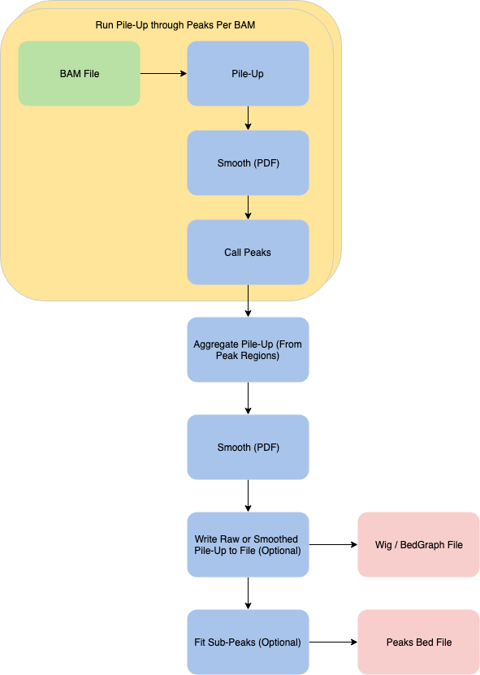
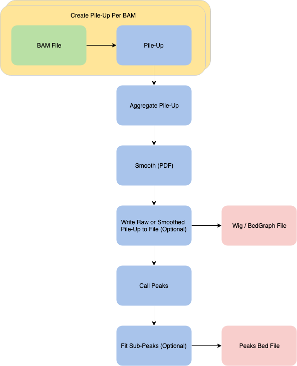

# ZPeaks

A Dockerized application for finding peaks from alignment files.

## Modes

ZPeaks can run in three modes: Single File, Top Down, and Bottom Up.

Every mode starts by checking for indexes for each BAM inputs. If they already exist, this will be skipped. The 
indexes will have the same name as the bams, but appended with ".bai"

### Single File

Single File mode is for calculating peaks for a single BAM input file.



### Top Down

Top Down mode is for calculating peaks on multiple BAM input files. This mode will call peaks for individual files, 
aggregate only the pile-up data from those peak regions, then smooth and fit sub-peaks on the aggregate data.

It will tend to give you more regions and will not miss those only present in only few files.



### Bottom Up

Bottom Up mode is for calcaulting peaks on multiple BAM input files. This mode will create a scaled pile-up from 
many files, then smooth and fit sub-peaks on the aggregate pile-up.

It will tend to give you fewer regions that are more pronounced / in more files.



## Requirements

- Memory: 
    - Single File: LCS * 4B + 1GB (typically 2GB for human)
    - Bottom Up: LCS * 6B + 1GB (typically 2.5GB for human)
    - Top Down: LCS * 8B + 1GB (typically 3GB for human)
- CPUs: ZPeaks can parallelize for compute intensive tasks at a sub-chromosome level. It will run efficiently with 
any number of cores.

*LCS = The largest chromosome size (in base pairs) in your file(s). For human, it's Chr1 with 250,000,000.

## Running

The built docker container can be found on docker hub as genomealmanac/zpeaks.

To run make sure the files you pass are accessible within the container and run the container with the command 
followed by the arguments you need:

`java -jar /app/zpeaks.jar`

### Arguments

| Name |  Description | Default |
|---|---|---|
| `-runType` | Run type if multiple files are given. "top-down" or "bottom-up" | bottom-up |
| `-bamIn`| Input Sam or Bam alignment file. Cannot be used with -pileupIn. | |
| `-pileupIn`| Input bedGraph pileup. Cannot be used with -pileupIn. | |
| `-chrFilter` | Chromosome Filter File. See Below. | |
| `-signalOut`| Output Signal File. Enables signal output. | |
| `-signalOutType`| Output "raw" and "smoothed" Pile-Up data to the signal file. | smoothed |
| `-signalOutFormat`| Output Signal File to "wig" or "bed-graph" file | bed-graph |
| `-peaksOut`| Output peaks bed file. | |
| `-strand`| Strand to count during pile-up. "plus", "minus", or "both". Ignored if not using -bamIn. | both |
| `-forwardShift`| During pile-up, shift the forward strand by this amount. Can be positive or negative. Ignored if not using -bamIn. | 0 |
| `-reverseShift`| During pile-up, shift the reverse strand by this amount. Can be positive or negative. Ignored if not using -bamIn. | 0 |
| `-pileUpAlgorithm`| Algorithm used to select values during pile-up. "start", "midpoint", or "length". Ignored if not using -bamIn. | start |
| `-signalResolution`| Number of decimal places to keep in outputted signal values. | 1 |
| `-smoothingFactor` | Smoothing factor for calculating PDF for pile-up data during peaks step. | 50.0 |
| `-threshold`| Threshold used during peak calling. | 6.0 |
| `-fitMode`| Sub-peak fitting modes. "skew" or "standard" | skew |
| `-parallelism`| Number of threads to use for parallel operations. | Number of cores on machine |
| `-h`, `--help`| Show help message and exit. | |

The sam input file and at least one output file are required. Here's how a complete command with arguments should look:

`java -jar /app/zpeaks.jar -samIn=/data/in/my_exp.bam -subPeaksOut=/data/out/my_exp.bed`

### Chromosome Filter Files

Chromosome filter files allow you to only find peaks for a given set of chromosomes. You may optionally provide a range 
within the chromosome if you only want peaks within a region of a chromosome. 

For example, the following will calculate peaks for chromosome 1, 10-15 million on chromosome 2, and 
0-3 million on chromosome 3:

```
chr1
chr2    10000000-15000000
chr3    0-3000000
```

## Output

### Peaks bed file

The output peaks file contains the locations of fitted gaussian curves in BED format with the amplitude and skew (if applicable). A random peak name is assigned to each peak. The current format of the output peaks file is:

When -fitMode is set to "skew":
```
chrom   start   end peak_name   amplitude#skew
```

When -fitMode is set to "standard":
```
chrom   start   end peak_name   amplitude
```

## For Contributors

The scripts/ directory contains utilities you can use to build, test, and deploy

### Building

To build the docker container with a tag, use `scripts/build-image.sh`.
To build the Jar locally, use `scripts/build-local.sh`
To run the built Jar, use `scripts/run-local.sh`

### Testing

To run automated tests from command line, use `scripts/test.sh`
To run plots or performance tests, either run from IDE or comment out @Disabled on the tests and run individual tests 
manually with something like `./gradlew test --tests Plot."Plot Skew Sub-Peaks"`

### Deploying

To deploy the image to our docker repository, use `scripts/push-image.sh`